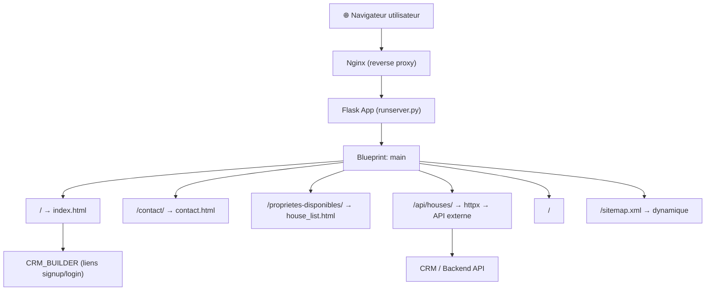

# VENONE — Application de Gestion Locative et Immobilière

**Venone** est une solution SaaS de gestion locative et immobilière ciblant les propriétaires et agences immobilières.
Ce dépôt contient le **site vitrine** (landing page) de l'application.

---

## Fonctionnalités présentées

- Gestion des biens immobiliers et suivi des propriétaires
- Recensement des unités locatives (appartements, maisons…)
- Enregistrement des locataires et affectation aux logements
- Suivi des paiements de loyers (dépôts, avances, règlements)
- Déduction automatique des frais de gestion (le 10 de chaque mois)
- Calcul automatique des pénalités après le 15 du mois (10% du loyer)
- Alerte d'expulsion après 3 mois d'impayés
- Notifications SMS aux locataires
- Édition de contrats (bailleur / locataire / quittances de règlement)
- Rapports financiers et statistiques d'activité

---

## Stack technique

| Composant | Technologie |
|---|---|
| Langage | Python 3.10 |
| Framework web | Flask 2.2.x |
| Moteur de templates | Jinja2 |
| CSS / UI | Bootstrap 5 + Bootstrap Icons |
| Pages de contenu | Flask-FlatPages (Markdown → HTML) |
| HTTP client | `httpx` |
| Minification | Flask-Minify |
| Conteneurisation | Docker + docker-compose + Nginx |
| Qualité de code | pre-commit, flake8, isort, black |
| Tests | `unittest` (stdlib Python) |
| Gestionnaire de paquets | Pipenv |

---

## Architecture du projet

```
venone-web/
├── app/
│   ├── plugins.py         # Initialisation des extensions Flask
│   ├── cli.py             # Point d'entrée
│   ├── config.py          # Configurations Dev / Prod / Test
│   ├── routes.py          # Toutes les routes du site
│   ├── main.py            # App factory (create_app)
│   ├── pages/             # Contenu statique en Markdown (FlatPages)
│   │   ├── a-propos.md
│   │   ├── faq.md
│   │   ├── tarifs.md
│   │   ├── terms.md
│   │   └── …
│   ├── templates/
│   │   ├── _base.html     # Template de base
│   │   ├── index.html     # Page d'accueil
│   │   ├── sitemap.xml    # Sitemap dynamique
│   │   ├── includes/      # Composants réutilisables (partials)
│   │   └── page/          # Pages spécifiques (contact, erreurs, biens…)
│   └── static/            # Assets (images, CSS, JS)
├── tests/                 # Tests unitaires
├── Dockerfile
├── compose.yml
├── Makefile
└── Pipfile
```

### Routes exposées

| URL | Description |
|---|---|
| `/` | Page d'accueil (landing page) |
| `/contact/` | Page contact |
| `/proprietes-disponibles/` | Liste des propriétés disponibles |
| `/api/houses/` | Proxy vers l'API externe (CRM backend) |
| `/<path:path>/` | Pages Markdown via FlatPages |
| `/sitemap.xml/` | Sitemap XML dynamique |
| `/robots.txt/` | Fichier robots.txt |

---

## Diagramme de flux



---

## Installation et lancement

### Prérequis
- Python 3.10+
- Pipenv
- Docker & docker-compose (optionnel)

### 1. Cloner le projet

```bash
git clone https://github.com/flavien-hugs/venone-web.git
cd venone-web
```

### 2. Copier et configurer les variables d'environnement

```bash
cp .env.example .env
# Éditer .env avec vos valeurs (SECRET_KEY, API_URL, CRM_BASE_URL…)
```

### 3. Installer les dépendances

```bash
pipenv install
# ou
make pipenv-install
```

### 4. Lancer en développement

```bash
pipenv shell
python runserver.py
# ou
make run  # via Docker
```

### 5. Accéder à l'application

```
http://localhost:5000/
```

---

## Commandes utiles (Makefile)

```bash
make help           # Afficher toutes les commandes disponibles
make pipenv-install # Installer les dépendances
make test           # Lancer les tests unitaires
make run            # Lancer avec Docker Compose
make logs           # Voir les logs des conteneurs
make down           # Arrêter et supprimer les conteneurs
```

---

## Tests

```bash
make test
# ou
python3 -m unittest discover -s tests
```

---

## Auteur

Code : [flavien-hugs](https://twitter.com/flavien_hugs)

## Licence

Ce projet est sous licence MIT — voir le fichier [LICENSE](LICENSE) pour plus de détails.
