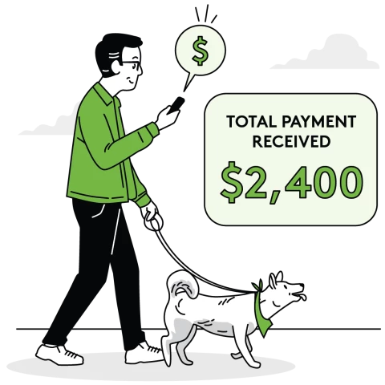

title: Détail de l’offre tarifaire Venone
subtitle: Bénéficiez de plusieurs fonctionnalités avec la grille tarifaire de Venone

    

    	

    		<h1 class="fs-2 lh-base fw-bold text-primary">
    			Tarifs
    		</h1>
            <h1 class="fs-3 lh-base fw-bold">
                Bénéficiez de plusieurs fonctionnalités avec la grille tarifaire de Venone
            </h1>
    	

    	

    		
    	

    

    

        

            <h1 class="fs-2 lh-base fw-bold text-primary">
                Comment   nous facturons ?
            </h1>
        

        

            

                <h1 class="fs-4 mb-3">Pour les agences immobilières</h1>
                

                    <strong class="fs-4 text-danger">6%</strong> récupérer sur chaque loyer.
                

                

                    <ul class="list-group list-group-borderless mb-4">
                        <li class="list-group-item fw-light d-flex">
                            <i class="fas fa-check-circle text-success me-2"></i>
                            Tableau de bord complet
                        </li>
                        <li class="list-group-item fw-light d-flex mb-0">
                            <i class="fas fa-check-circle text-success me-2"></i>
                            Accès à la Liste des propriétés disponibles dans votre zone
                        </li>
                        <li class="list-group-item fw-light d-flex mb-0">
                            <i class="fas fa-check-circle text-success me-2"></i>
                            Traitement de paiement instantané
                        </li>
                        <li class="list-group-item fw-light d-flex mb-0">
                            <i class="fas fa-check-circle text-success me-2"></i>
                            Statistiques en temps réel
                        </li>
                        <li class="list-group-item fw-light d-flex mb-0">
                            <i class="fas fa-check-circle text-success me-2"></i>
                            Rappel de paiement via SMS
                        </li>
                        <li class="list-group-item fw-light d-flex mb-0">
                            <i class="fas fa-check-circle text-success me-2"></i>
                            Assistance technique 24h/24
                        </li>
                    </ul>
                

            

        

        

            

                <h1 class="fs-4 mb-3">Pour les propriétaires de maison</h1>
                
<strong class="fs-4 text-danger">7%</strong> récupérer sur chaque loyer.

                

                    <ul class="list-group list-group-borderless mb-4">
                        <li class="list-group-item fw-light d-flex">
                            <i class="fas fa-check-circle text-success me-2"></i>
                            Tableau de bord complet
                        </li>
                        <li class="list-group-item fw-light d-flex mb-0">
                            <i class="fas fa-check-circle text-success me-2"></i>
                            Traitement de paiement instantané
                        </li>
                        <li class="list-group-item fw-light d-flex mb-0">
                            <i class="fas fa-check-circle text-success me-2"></i>
                            Statistiques en temps réel
                        </li>
                        <li class="list-group-item fw-light d-flex mb-0">
                            <i class="fas fa-check-circle text-success me-2"></i>
                            Rappel de paiement via SMS
                        </li>
                        <li class="list-group-item fw-light d-flex mb-0">
                            <i class="fas fa-check-circle text-success me-2"></i>
                            Assistance technique 24h/24
                        </li>
                    </ul>
                

            

        

    

    

        

            <h1 class="fs-5 lh-base mb-3">
                Ne vous souciez plus de vos encaissements de loyers
            </h1>
            

                Venone gère vos rappelle de paiement de loyers, vous n'avez donc pas à :
            

            <ul class="list-group list-group-borderless mb-4">
                <li class="list-group-item fw-light d-flex">
                    <i class="fas fa-check text-success me-2"></i>
                    Automatisez les appels ou SMS aux locataires concernant les paiements de loyer à venir ou en retard
                </li>
                <li class="list-group-item fw-light d-flex mb-0">
                    <i class="fas fa-check text-success me-2"></i>
                    Automatisez les frais de retard
                </li>
            </ul>
        

        

            
        

    

    

        

            

                

                    
                

            

        

        

            <h1 class="fs-3 lh-base fw-bold text-primary">Moyens de paiements</h1>
            
Venone est une application de gestion immobilière qui assure la sécurité de vos informations personnelles et financières en utilisant des mesures de sécurité avancées.

        

    

